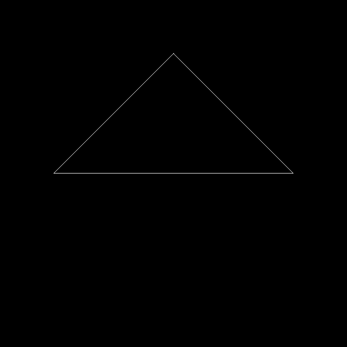

# GAMES101-现代计算机图形学入门

要求填写部分代码有详细中文注释，注释中包含一些常见问题解决方法的链接。

额外要求都尽可能完成了，作业代码框架存在部分问题，根据论坛上的的讨论，有对原有框架代码进行变动，参考时请注意。

（话说论坛居然没个搜索功能...）

## 任务1

代码包含提高项：绕任意过原点的轴的旋转变换矩阵

## 任务2

### 基本任务 - 深度测试

### 开启MSAA抗锯齿

完成了提高项内容，对三角形边界做了MSAA(2x2)，至于绿色三角形黑边的问题是没有做alpha透明度的混合，默认相当于直接和黑色混合了

## 任务3

应该算是完美还原了...连牛脸上的两个黑色像素点都和任务书里的结果图一样

论坛任务3[FAQ](https://games-cn.org/forums/topic/frequently-asked-questionskeep-updating/)

### Texture shader

### Normal shader

### Blinn-phong shader

### Bump shader

### Displacement shader

## 任务4

做了贝塞尔曲线的抗锯齿，上下两条是对比

---

待续